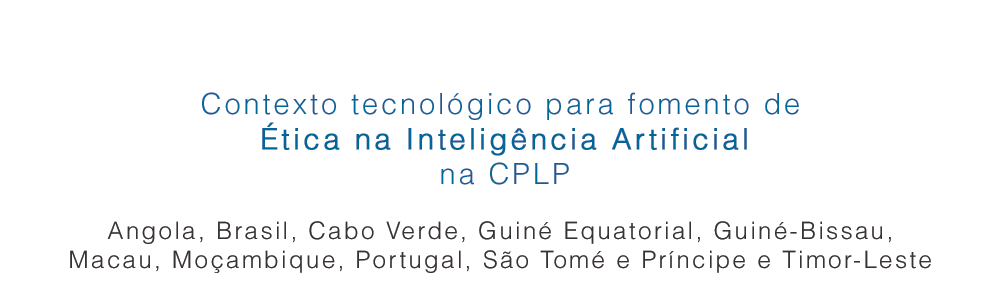

# Contexto tecnológico para fomento de Ética na Inteligência Artificial na CPLP

**Contexto tecnológico para fomento de Ética na Inteligência Artificial na Comunidade dos Países de Língua Portuguesa
(CPLP): Angola, Brasil, Cabo Verde, Guiné Equatorial, Guiné-Bissau,
Macau [(\*)](#sobre-macau-na-cplp), Moçambique, Portugal, São Tomé e Príncipe e
Timor-Leste.**

---

Veja também: [pt.etica.ai](https://pt.etica.ai) \| [docs.etica.ai/pt](https://docs.etica.ai/pt) \| _cplp.etica.ai_ \| [periferia.etica.ai](https://periferia.etica.ai) \| [brasil.etica.ai](https://brasil.etica.ai) \| [groups.etica.ai](https://groups.etica.ai/) Inglês \| [standards.etica.ai](https://standards.etica.ai) Inglês

---

# Índice de conteúdo

<!-- TOC depthFrom:2 depthTo:5 -->

- [Visão Geral sobre cada país da CPLP](#visão-geral-sobre-cada-país-da-cplp)
    - [Dados](#dados)
    - [Atalhos](#atalhos)
- [Visão Geral sobre toda CPLP](#visão-geral-sobre-toda-cplp)
    - [Direitos Humanos](#direitos-humanos)
        - [Visão geral sobre direitos humanos](#visão-geral-sobre-direitos-humanos)
            - [Amnesty International](#amnesty-international)
            - [Human Rights Watch](#human-rights-watch)
        - [Transexualidade](#transexualidade)
            - [transrespect.org](#transrespectorg)
    - [Horário em tempo real](#horário-em-tempo-real)
    - [Infraestrutura](#infraestrutura)
        - [Acesso à eletricidade](#acesso-à-eletricidade)
        - [Acesso à internet](#acesso-à-internet)
        - [Acesso à internet de banda larga fixa](#acesso-à-internet-de-banda-larga-fixa)
        - [Cabos submarinos](#cabos-submarinos)
        - [Censura da internet](#censura-da-internet)
            - [NetBlocks](#netblocks)
    - [Tráfego de aviões em tempo real](#tráfego-de-aviões-em-tempo-real)
    - [Tráfego de navios em tempo real](#tráfego-de-navios-em-tempo-real)
- [Legislação](#legislação)
    - [Legislação internacional sobre direitos humanos](#legislação-internacional-sobre-direitos-humanos)
- [Relatórios com opção em português](#relatórios-com-opção-em-português)
    - [Estudos de caso](#estudos-de-caso)
    - [Infraestrutura](#infraestrutura-1)
    - [Inteligência artificial](#inteligência-artificial)
    - [Previsões](#previsões)
- [Organizações internacionais](#organizações-internacionais)
    - [CPLP](#cplp)
        - [Sobre Macau na CPLP](#sobre-macau-na-cplp)
    - [PALOP](#palop)
    - [UA](#ua)
    - [UCCLA](#uccla)

<!-- /TOC -->

<!--

///## Sobre
Este repositório de informações pode ser útil tanto para quem quer entender
o contexto tecnológico de países falantes da língua portuguesa. (...)

_TODO: continuar explicação mínima (fititnt, 2019-03-23 09:53 BRT)_

-->

<!--
Este repositório de informações surgiu do [Recursos para pessoas desenvolvedoras de periferia](https://periferia.etica.ai/).
-->

## Visão Geral sobre cada país da CPLP
<!-- Lista informações e atalhos rápidos sobre os países individualmente. -->

### Dados

<!-- Nota: para evitar exibir por vários dias um documento incompleto, os campos faltantes serão ocultados por agora na tabela dados (fititnt, 2019-03-27 03:51 BRT) -->

<!--

> Nota: dados como % de acesso a hardware e padrão tipo de acesso a internet
ainda estão sendo investigados. Mesmo em países grandes a informação pode ser
divergente e muda com grande velocidade.

-->

| Tema X País | Angola | Brasil | Cabo Verde | Guiné Equatorial | Guiné-Bissau | Macau[(\*)](#sobre-macau-na-cplp) | Moçambique | Portugal | São Tomé e Príncipe | Timor-Leste |
| ---| ---: | ---: | ---: | ---: | ---: | ---: | ---: | ---: | ---: | ---: |
| População&nbsp;total | 29.000.000+ | 210.000.000+ | 560.000+ | 1.221.490+ | 1.792.338+ | 667.400+ | 28.861.863+ | 10.374.822+ | 204.454+ | 1.291.358+ |
| Idiomas  ([POR]((https://pt.wikipedia.org/wiki/Lista_de_pa%C3%ADses_onde_o_portugu%C3%AAs_%C3%A9_l%C3%ADngua_oficial)) [ENG](https://en.wikipedia.org/wiki/List_of_countries_by_English-speaking_population))| **Português&nbsp;85%+** | **Português&nbsp;99%+** Inglês&nbsp;5%+ | **Português&nbsp;\_\_%+** **[Crioulo&nbsp;\_\_%+](https://pt.wikipedia.org/wiki/Portugu%C3%AAs_cabo-verdiano)** | Espanhol&nbsp;90%+ Francês&nbsp;\_\_%+ **Português&nbsp;\_\_%+** | **Português&nbsp;50%+** [**Crioulo&nbsp;60%+**](https://pt.wikipedia.org/wiki/Portugu%C3%AAs_da_Guin%C3%A9-Bissau) | Chinês&nbsp;\_\_%+ [Cantonês&nbsp;50%+](https://pt.wikipedia.org/wiki/L%C3%ADngua_cantonesa)  Inglês&nbsp;\_\_%+ **Português&nbsp;3‑7%+** | [Línguas&nbsp;Bantas&nbsp;\_\_%+](https://pt.wikipedia.org/wiki/Mo%C3%A7ambique#Idiomas) **Português&nbsp;65%+** [Suaíli&nbsp;\_\_+](https://pt.wikipedia.org/wiki/L%C3%ADngua_sua%C3%ADli) | **Português&nbsp;99%+** Inglês&nbsp;27%+ | **Português&nbsp;99%+** | **[Tétum&nbsp;__%+](https://pt.wikipedia.org/wiki/L%C3%ADngua_t%C3%A9tum)** **Português&nbsp;39%+** |
| Continente | Africa | América do Sul | Africa  | Africa | Africa | Asia | Africa | Europa | Africa | Sudeste Asiático |
| <abbr title="Fuso horário da Capital">Fuso Horário</abbr> | UTC+1 | UTC-3 | UTC-1  | UTC+1 | UTC0 | UTC+8 | UTC+2 | UTC−1 | UTC0 | UTC+9 |
| [Acesso à Eletricidade, 2016](#acesso-à-eletricidade) | <strong style="color:red">40,5%</strong> | 100% | 92,6%  | 67.9% | <strong style="color:red">14,7%</strong> | 100% | <strong style="color:red">24,2%</strong> | 100% | 65,4% | 63,4% |
| [Acesso à Internet, 2016](#acesso-à-internet) | <strong style="color:red">13%</strong> | 61% | <strong style="color:red">50%</strong>  | <strong style="color:red">24%</strong> | <strong style="color:red">4%</strong> | 82% | <strong style="color:red">18%</strong> | 70% | <strong style="color:red">28%</strong> | <strong style="color:red">25%</strong> |
| [Acesso à Internet de banda larga fixa, 2016 (por 100 pessoas)](#acesso-à-internet-de-banda-larga-fixa)| 0,43 | 12,89 | 2,88  | 0,28 | 0,04 | 29,07 | 0,16 | 32,55 | 0,71 | 0,08 |
| Domínio de Topo | .ao | .br | .cv  | .gq | .gw | .mo | .mz | .pt | .st | .tl / .tp |

<!-- 
| Computador pessoal | \_\_% | \_\_% | \_\_% | \_\_% | \_\_% | \_\_% | \_\_% | \_\_% | \_\_% | \_\_% |
| Smartphone | \_\_% | \_\_% | \_\_% | \_\_% | \_\_% | \_\_% | \_\_% | \_\_% | \_\_% | \_\_% |
| Internet | \_\_% | \_\_% | \_\_% | \_\_% | \_\_% | \_\_% | \_\_% | \_\_% | \_\_% | \_\_% |
| Internet (em&nbsp;casa) | \_\_% | \_\_% | \_\_% | \_\_% | \_\_% | \_\_% | \_\_% | \_\_% | \_\_% | \_\_% |

**Informação importante**: esteja ciente de [viés de sobrevivente inglês](https://en.wikipedia.org/wiki/Survivorship_bias)
ao considerar realidade de países apenas por pessoas que já passaram por algum
processo de seleção.

| Emoji País | :angola: | 🇧🇷 | .cv  | .gq | .gw | .mo | .mz | .pt | .st | .tl / .tp |

-->

<!--
Geralmente (mas não sempre)
pessoas que já trabalhem com tecnologia e estejam
interagindo em redes sociais (em especial em países com estatísticas mais
baixas em relação aos demais) 
-->

### Atalhos

| Tema X País | Angola | Brasil | Cabo Verde | Guiné Equatorial | Guiné-Bissau | Macau[(\*)](#sobre-macau-na-cplp) | Moçambique | Portugal | São Tomé e Príncipe | Timor-Leste |
| --- | --- | --- | --- | --- | --- | --- | --- | --- | --- | --- |
| Wikipédia,&nbsp;País | [Angola](https://pt.wikipedia.org/wiki/Angola) | [Brasil](https://pt.wikipedia.org/wiki/Brasil) | [Cabo&nbsp;Verde](https://pt.wikipedia.org/wiki/Cabo_Verde)  | [Guiné&nbsp;Equatorial](https://pt.wikipedia.org/wiki/Guin%C3%A9_Equatorial) | [Guiné‑Bissau](https://pt.wikipedia.org/wiki/Guin%C3%A9-Bissau) | [Macau](https://pt.wikipedia.org/wiki/Macau) | [Moçambique](https://pt.wikipedia.org/wiki/Mo%C3%A7ambique) | [Portugal](https://pt.wikipedia.org/wiki/Portugal) | [São&nbsp;Tomé&nbsp;e&nbsp;Príncipe](https://pt.wikipedia.org/wiki/S%C3%A3o_Tom%C3%A9_e_Pr%C3%ADncipe) | [Timor‑Leste](https://pt.wikipedia.org/wiki/Timor-Leste) |
| Site do Governo | [Angola](http://www.angola.gov.ao) | [Brasil](http://www.brasil.gov.br) | [Cabo Verde](http://www.governo.cv/) | [Guiné Equatorial](https://www.guineaecuatorialpress.com/) | [Guiné-Bissau](http://www.gov.gw/) | [Macau](https://www.gov.mo/pt/) | [Moçambique](http://www.portaldogoverno.gov.mz/) | [Portugal](http://www.portugal.gov.pt/) | [São Tomé e Príncipe](http://www.presidencia.st/) | [Timor-Leste](http://www.timor-leste.gov.tl/) |
| [Human&nbsp;Rights&nbsp;Watch](#human-rights-watch) | [Angola](https://www.hrw.org/pt/africa/angola) [**Angola&nbsp;2018**](https://www.hrw.org/pt/world-report/2019/country-chapters/326533) | [Brasil](https://www.hrw.org/pt/americas/brasil) [**Brasil&nbsp;2018**](https://www.hrw.org/pt/world-report/2019/country-chapters/326447) | Cabo Verde  | [Guiné Equatorial](https://www.hrw.org/pt/africa/guine-equatorial) | Guiné-Bissau | Macau | [Moçambique](https://www.hrw.org/pt/africa/mocambique) [**Moçambique&nbsp;2018**](https://www.hrw.org/pt/world-report/2019/country-chapters/326532) | Portugal | São Tomé e Príncipe | [Timor-Leste](https://www.hrw.org/pt/asia/timor-leste) |

## Visão Geral sobre toda CPLP

Os links abaixo exibem informações dos países da CPLP ou uma visão geral sobre
o mundo.

### Direitos Humanos

Atalho: veja nossa sessão de [Legislação internacional sobre direitos humanos](#legislação-internacional-sobre-direitos-humanos).

#### Visão geral sobre direitos humanos

##### Amnesty International
- Site: <https://www.amnesty.org/en/> (destino em inglês)
- Wikipédia: <https://pt.wikipedia.org/wiki/Amnesty_International>

##### Human Rights Watch
- Site: <https://www.hrw.org/pt>
- Wikipédia: <https://pt.wikipedia.org/wiki/Human_Rights_Watch>

Saiba mais [sobre a Human Rights Watch ➚](https://www.hrw.org/pt/sobre-human-rights-watch).

#### Transexualidade

##### transrespect.org
- Site: <https://transrespect.org> (destino em inglês)
- Mapa temático: [transrespect.org: Proteção legal anti-descriminação de pessoas pessoas transgêneros](https://transrespect.org/en/map/anti-discrimination/) (destino em inglês)
  - Nota: visite o site para acessar outros mapas temáticos; o exibido acima
    é apenas uma das diversas opções
- Avisos sobre o uso como referência:
  - **Informações de transrespect.org podem estar desatualizadas**
    - Tendência no caso de desatualização: não possuir _evoluções positivas_
      mais recentes, como alterações em legislação.

<!--
O site transrespect.org possui informação geral sobre diversos países do mundo
sobre pontos relacionados respeito e desrespeito no tema transexualidade com
opção de visualização rápida em formato mapa.
-->

### Horário em tempo real
- [Link do Time And Date com horários em tempo real das capitais da CPLP](https://www.timeanddate.com/worldclock/personal.html?cities=138,45,685,699,40,754,146,133,733,768&wch=3)

### Infraestrutura

#### Acesso à eletricidade

- [Worldbank Data: Acesso à Eletricidade, 1990-2016, CPLP](https://data.worldbank.org/indicator/EG.ELC.ACCS.ZS?locations=AO-BR-CV-GW-GQ-MO-MZ-PT-ST-TL) (destino em inglês)

#### Acesso à internet

- [Worldbank Data: Acesso à Internet, 1990-2016, CPLP](https://data.worldbank.org/indicator/IT.NET.USER.ZS?end=2016&locations=AO-BR-CV-GW-GQ-MO-MZ-PT-ST-TL&start=1990) (destino em inglês)

#### Acesso à internet de banda larga fixa

- [Worldbank Data: Acesso à Internet de banda larga fixa (por 100 pessoas), 1998-2016, CPLP](https://data.worldbank.org/indicator/IT.NET.BBND.P2?end=2016&locations=AO-BR-CV-GW-GQ-MO-MZ-PT-ST-TL&start=1998) (destino em inglês)

#### Cabos submarinos

- [Submarine Cable Map: Mapa interativo com cabos submarinos de conectam a internet mundial](https://www.submarinecablemap.com/)

#### Censura da internet

##### NetBlocks

- NetBlocks: Site: <https://netblocks.org>; Twitter: <https://twitter.com/netblocks>
  - Monitora e publica relatórios sobre Censura de Países à Internet
  - Pode exibir (porém faz questão de diferenciar) perda de acesso a internet por causa de queda de luz

### Tráfego de aviões em tempo real
- [Tráfego de aviões pelo Flight Radar24](https://www.flightradar24.com/0,0/3)

### Tráfego de navios em tempo real
- [Tráfego de navios pelo Marine Traffic](https://www.marinetraffic.com/pt/ais/home/centerx:15.4/centery:-7.9/zoom:3)

<!--
Hacks: a primeira linha tem spaço não quebrável "&nbsp; e hífen não quebrável, "‑", para permitir uma renderização melhor no GitHub e n formato site

| Tema X País | Angola | Brasil | Cabo Verde  | Guiné Equatorial | Guiné-Bissau | Macau | Moçambique | Portugal | São Tomé e Príncipe | Timor-Leste |
-->

## Legislação

### Legislação internacional sobre direitos humanos

Por favor, visite o site dedicado <https://docs.etica.ai/pt/>.

## Relatórios com opção em português
Os relatórios a seguir tem informações sobre os respectivos temas. Além de link
para os sites de origem, oferecemos também opção de cópia de segurança do
arquivo original e, caso não esteja em português, também uma alternativa
traduzida.

Informação importante: no caso da respectiva organização não fornecer documento
recomendável na língua portuguesa, a opção (que é é explicitamente informada)
terá opção feita com tradução automática de máquina. Você pode entrar em contato
com nossos voluntários caso precise de ajuda humana.

### Estudos de caso

- **[[2017-07-20] FGV DAPP \| Robôs, Redes Sociais e Política no Brasil (PDF; POR; 29pg; 971KB)](http://dapp.fgv.br/robos-redes-sociais-e-politica-estudo-da-fgvdapp-aponta-interferencias-ilegitimas-no-debate-publico-na-web/) (Pede e-mail)**
  - Alternativa: _[Cópia de segurança do original](https://f.etica.ai/cplp/2017-07-20_fgv-dapp_robos-redes-sociais-e-politica-no-brasil(original).pdf)_

### Infraestrutura

- **[2017] PAQUI \| Pan-African Quality Infrastructure, 2017 (PDF; ENG; 36pg; 1,5MB)** (original indisponível)
  - Alternativa: _[Cópia de segurança do original](https://f.etica.ai/cplp/2017_paqui_pan-african-quality-infrastructure(original).pdf)_
  - Alternativa com Tradução automática: _[Qualidade da Infra-estrutura Pan-Africana, 2017 (1,7MB)](https://f.etica.ai/cplp/2017_paqui_pan-african-quality-infrastructure(TradAuto.en-pt).pdf)_

### Inteligência artificial

- **[2018] IEEE-SA: IEEE-SA: Webinar Status Of Artificial Intelligence In Africa, 2018 (PDF; ENG; 36pg; 1,3MB) (Video; 1h25min:49s)**
  - Video no Youtube: [The Status of Autonomous and Intelligent Systems in Africa (1h25min:49s)](https://www.youtube.com/watch?v=sCzWw3kty7w)
  - PDF da apresentação: _[Cópia de segurança do original](https://f.etica.ai/cplp/2018_ieee-sa_webinar-status-of-artificial-intelligence-in-africa-2018(original).pdf)_
  - PDF da apresentação com tradução automática: _[IEEE-SA: Webinar Sobre o Estado da Inteligência Artificial na África, 2018](https://f.etica.ai/cplp/2018_ieee-sa_webinar-status-of-artificial-intelligence-in-africa-2018(TraducaoAutomatica_en-pt).pdf)_

### Previsões

- **[[2018-11] Access Partnership \| Artificial Intelligence for Africa: An Opportunity for Growth, Development, and Democratisation (PDF; ENG; 48pg; 1,4MB)](https://www.accesspartnership.com/cms/access-content/uploads/2018/11/WP-AI-for-Africa.pdf)**
  - Alternativa: _[Cópia de segurança do original](https://f.etica.ai/cplp/2018-11_access-partnership_ai-for-africa-growth-development-democratisation(original).pdf)_
  - Alternativa com Tradução automática: _[Inteligência Artificial para a África: Uma Oportunidade para o Crescimento, Desenvolvimento e democratização (2,6MB)](https://f.etica.ai/cplp/2018-11_access-partnership_ai-for-africa-growth-development-democratisation(TradAuto.en-pt).pdf)_
- **[[2017] Accenture \| How Artificial Intelligence Can Drive South Americas Growth (PDF; ENG; 30pg; 1,5MB)](https://www.accenture.com/_acnmedia/PDF-49/Accenture-How-Artificial-Intelligence-Can-Drive-South-Americas-Growth.pdf)**
  - Alternativa: _[Cópia de segurança do original](https://f.etica.ai/cplp/2017_accenture_how-ai-can-drive-south-america-growth(original).pdf)_
  - Alternativa com Tradução automática: _[Como a inteligência artificial pode impulsionar o crescimento da América do Sul (1,7MB)](https://f.etica.ai/cplp/2017_accenture_how-ai-can-drive-south-america-growth(TradAuto.en.pt).pdf)_

## Organizações internacionais

### CPLP
- Nome: Comunidade dos Países de Língua Portuguesa
- Site Oficial: <http://www.cplp.org/>
- Na Wikipedia: <https://pt.wikipedia.org/wiki/Comunidade_dos_Pa%C3%ADses_de_L%C3%ADngua_Portuguesa>
- Estados-membro:
  - Angola
  - Brasil
  - Cabo Verde
  - Guiné-Bissau
  - Guiné Equatorial
  - Moçambique
  - Portugal
  - São Tomé e Príncipe
  - Timor-Leste

#### Sobre Macau na CPLP
Macau é uma das é uma das duas regiões administrativas especiais da República
Popular da China (a outra é Hong Kong). Seguem o conceito de
[Um país, dois sistemas](https://pt.wikipedia.org/wiki/Um_pa%C3%ADs,_dois_sistemas)
e [Lei Básica de Macau](https://pt.wikipedia.org/wiki/Lei_B%C3%A1sica_da_Regi%C3%A3o_Administrativa_Especial_de_Macau).
De forma muito simplificada, Macau (chamada oficialmente de "Região
Administrativa Especial de Macau da República Popular da China" - RAEM) tem
alto grau de autonomia interna, porém decisões decisões de política externa
(como opção de oficialmente ser membro da CPLP) dependeriam da própria China
assinar como estado-membro. Isso explica porque **oficialmente** não é membro.

Outras informações rápidas (algumas podem não ser intuitivas):
- Português, ainda que pouco falada, é uma das duas línguas oficiais. A outra é
  o chinês (não especificado qual deles), sendo tipicamente usado
  [chinês tradicional](https://pt.wikipedia.org/wiki/Chin%C3%AAs_tradicional) e o
  [cantonês](https://pt.wikipedia.org/wiki/L%C3%ADngua_cantonesa).
- Macau é capitalista (Tem até mesmo cassinos). Segundo maior GDP do mundo
  (primeiro é Qatar). O Índice de Desenvolvimento Humano (IDH) é altíssimo.
- Macau tem a maior densidade populacional do mundo. 2/3 de sua área é
  aterramento do oceano.

### PALOP
- Nome: **Países Africanos de Língua Oficial Portuguesa**
- Na Wikipédia: [Países Africanos de Língua Oficial Portuguesa (PALOP)](https://pt.wikipedia.org/wiki/Pa%C3%ADses_Africanos_de_L%C3%ADngua_Oficial_Portuguesa)
- Estados-membro:
  - Angola
  - Cabo Verde
  - Guiné-Bissau
  - Guiné Equatorial
  - Moçambique
  - São Tomé e Príncipe

### UA
- Nome: **União Africana**
- Site: <https://au.int/>
- Estados-membro (da CPLP):
  - Angola
  - Cabo Verde
  - Guiné-Bissau
  - Guiné Equatorial
  - Moçambique
  - São Tomé e Príncipe

### UCCLA
- Nome: **União das Cidades Capitais Luso-Afro-Américo-Asiáticas**
- Na Wikipédia: [União das Cidades Capitais Luso-Afro-Américo-Asiáticas (UCCLA)](https://pt.wikipedia.org/wiki/Uni%C3%A3o_das_Cidades_Capitais_Luso-Afro-Am%C3%A9rico-Asi%C3%A1ticas)

# Licença

Na medida do possível segundo a lei, [Emerson Rocha](https://github.com/fititnt)
renunciou a todos os direitos autorais e direitos conexos ou vizinhos a este
trabalho para o [Domínio Público](UNLICENSE).
